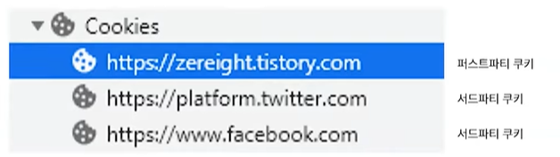

# 웹스토리지 & 쿠키
## 쿠키
브라우저에 저장되는 작은 크기의 문자열(최대 4KB)

### 쿠키 특징
* 주로 서버에서 사용 Set-Cookie: <cookie-name> = <cookie-value>
* 요청 시 Headers에 전송
  * 같은 도메인에서 만들어진 쿠키만 정송 
* 만료 기간 지정 가능
  * Expires, Max-Age 둘 다 전송된다면 Expires는 무시됨
```
Set-Cookie: <cookie-name> = <cookie-value>; Expires=<date>
Set-Cookie: <cookie-name> = <cookie-value>; Max-Age=<number>
```
* 만료기간에 따라 영구 쿠키와 새션 쿠키로 나눔
<table>
    <tr>
        <th>영구 쿠키<br/> (Persistent Cookie)</th>
        <th>세션 쿠키<br/> (Session Cookie)</th>
    </tr>
    <tr>
        <td>만료 기간 O</td>
        <td>만료 기간 X</td>
    </tr>
    <tr>
        <td>만료 기간이 끝난 후 삭제</td>
        <td>브라우저 종료 시 삭제</td>
    </tr>
</table>

* 쿠키 종류
<table>
    <tr>
        <th>퍼스트파트 쿠키<br/> (First party Cookie)</th>
        <th>서드파티 쿠키<br/> (Third party Cookie)</th>
    </tr>
    <tr>
        <td>같은 도메인 naver.com</td>
        <td>다른 도메인 facebook.com</td>
    </tr>
    <tr>
        <td>서브 도메인 m.naver.com</td>
        <td>-</td>
    </tr>
</table>

* 서드파티 쿠키
  * 스크립트, 이미지, 폰트, 아이프레임 등 다른 도메인으로 요청을 해야하는 경우에 생성됨
  * 주로 광고 목적으로 사용됨



### 쿠키의 문제점
<table>
    <tr>
        <th>CSRF</th>
        <td>사용자의 권한을 이용한 공격<br/> (비밀번호 변경, 결제 요청 등)</td>
    </tr>
    <tr>
        <th>
            XSS 
            <br>
            <span style="font-size: 10px"> 
                Reflected XSS<br/>
                Stroed XSS<br/>
                Dom-based XSS
            </span>
        </th>
    <td>사용자의 민감한 정보 탈취(토큰)</td>
    </tr>
    <tr>
        <th>부족한 저장 용량</th>
        <td>4KB</td>
    </tr>
    <tr>
        <th>HTTP 요청 시 자동으로 모든 쿠키 전송</th>
        <td>불필요한 트래픽 증가</td>
    </tr>
</table>

## 웹 스토리지
웹 스토리지는 HTML5에서 추가된 저장소.

### 웹 스토리지 특징
<table>
    <tr>
        <th>5MB의 저장 용량</th>
        <td>쿠키의 부족한 저장 용량 문제 해결</td>
    </tr>
    <tr>
        <th>요청 시 Headers에 전송하지 않음</th>
        <td>쿠키의 CSRF, 트래픽 문제 해결</td>
    </tr>
    <tr>
        <th>문자열만 저장 가능</th>
        <td>직렬화를 통해 객체 저장 가능</td>
    </tr>
</table>

### 로컬 스토리지와 세션 스토리지
* 간단한 키와 값을 저장할 수 있음. <br/>
* key - value 스토리지의 형태

<table>
    <tr>
        <th>/</th>
        <th>로컬 스토리지</th>
        <th>세션 스토리지</th>
    </tr>
    <tr>
        <td>저장 범위</td>
        <td>도메인 / 브라우저</td>
        <td>도메인 / 브라우저 / 탭</td>
    </tr>
    <tr>
        <td>데이터 영구</td>
        <td>O (직접 삭제 시)</td>
        <td>X (윈도우, 탭 닫을시 내용 제거)</td>
    </tr>
    <tr>
        <td>사용방법</td>
        <td>자동 로그인</td>
        <td>일회성 로그인</td>
    </tr>
    <tr>
        <td>주의사항</td>
        <td colspan="2">비밀번호와 같은 중요 정보는 절대 저장 X</td>
    </tr>
</table>

### 웹 스토리지의 문제점
<table>
    <tr>
        <th>XSS</th>
        <td>자바스크립트로 접근 가능</td></td>
    </tr>
    <tr>
        <th>독립된 스토리지</th>
        <td>브라우저 / 탭(세션 스토리지) 간 공유 불가</td>
    </tr>
    <tr>
        <td colspan="2">만료 기간 설정 불가</td>
    </tr>
    <tr>
        <th>동기적 실행</th>
        <td>메인 스레드 블로킹<br/> 용량이 크다면 IndexedDB 고려</td>
    </tr>
</table>

# Reference
[우아한테크코스 테코톡](https://www.youtube.com/watch?v=-4ZsGy1LOiE&ab_channel=%EC%9A%B0%EC%95%84%ED%95%9CTech)