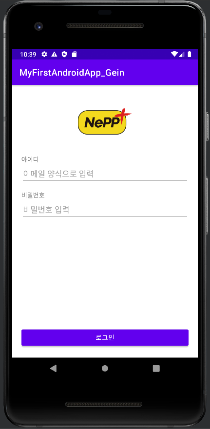

# Android

## Activity
* 개요
  * 앱에서 하나의 화면을 지칭하는 단어.
* 액티비티의 구성 요소
  * xml (layout) : 액티비티가 화면에 나타날 때, "어떤 모양"으로 나타날지 결정하는 파일
  * kt (코틀린 파일 - java 폴더) : 액티비티가 일단 나타나고 난 후 (xml이 등장한 후) 이뤄질 동작들을 작성하는 용도의 파일. (JAVA - 일종의 클래스)
* 고려사항
  * xml, kt는 별개의 파일이지만 하나의 액티비티로 동작함
  * kt 파일의 onCreate 함수 내부의 setContentView의 매개변수가 무엇이냐에 따라 어떤 xml 파일을 불러올지 결정
  * xml으로 화면을 그릴 떄, 코틀린에서 가져다 써야겠다는 판단이 드는 요소들은 id 속성을 부여하고
  * id에 적은 값을 그대로 코틀린 코드에 적어서 자동완성하면 가져다 쓸 수 있다.
* 참고사항
  * JAVA에서는 같은 작업을 위한 코드 작업이 추가로 필요함.

## 주소 참고
* [깃허브 자료](https://github.com/hj20220908/MyFirstAndroidApp_Gein)